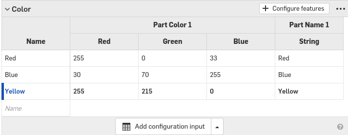
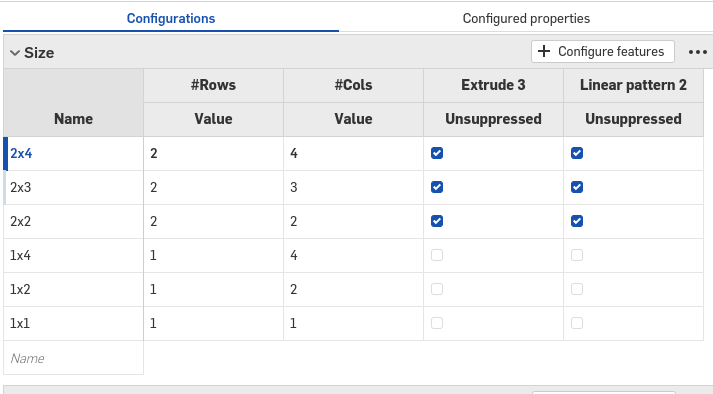
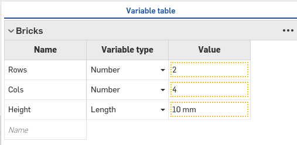

# CAD-Designing

## Designing the Skateboard

### Description

This assignment is making a skateboard's deck. with holes for the trucks. the height of the board in **top** view is **9 inches**, and the length is **31 inches**, and the width is **1 inch**. The rectangle for the holes is **1.625 high**, and **2.125 wide**, *mirrored* and holes added to the corner using the *holes tool*.

### Evidence

[SkateBoard Assembly](https://cvilleschools.onshape.com/documents/1f59b8da98c9e6cf04f4f3df/w/f19d7c0228838a16a5d3accf/e/a78429891a6bb9a07634fb47)

### Image

### Reflection

This assignment was a bit hard because The rectangle wouldn't look like intended by the embeded video in the tutorial document. So, I deleted the hole sketch and retried the steps which helped fix the problem. I wouldn't spend too much time fixing a problem if I can delete it and re-do it *correctly*

---

## Designing the Trucks

### Description

This assignment is about making the trucks. The *base* of the trucks are **0.25inches (offset)** from the **construction line** and *extruded 0.25in*. the *truck baseplate*'s first layer is **0.5in in height**, & the 2nd layer is **0.375mm** & is **1.5 inches in length**.They are both extruded **0.75in** and are **symmetric**. The *inner truck hanger* circle is **8.5in** while the *outer circle* is **6in** + they are both *symmetric*.

### Evidence

[SkateBoard Assembly](https://cvilleschools.onshape.com/documents/1f59b8da98c9e6cf04f4f3df/w/f19d7c0228838a16a5d3accf/e/a78429891a6bb9a07634fb47)

### Image

### Reflection

This assignment was a Bit difficult mostly because I didn't know if the Truck Hanger was at the right spot even after following the instructions. Also I added the ledge after completing the whole truck. *don't spend too much time on one problem, move on and get the 'easy' work done first then come to solve the 'hard' problem.*

---

## Designing the Wheels and Bearing

### Description

This assignment is about making the wheels and bearings. The wheels are **revolved** around 360*. The wheel is **36mm in length** and the bearing is **0.5inches in lenght**. the wheel is **54mm in height** from the **construction line**  **( L + q)** and the bearing circle is **0.25in** from the *construction line*   

### Evidence

[SkateBoard Assembly](https://cvilleschools.onshape.com/documents/1f59b8da98c9e6cf04f4f3df/w/f19d7c0228838a16a5d3accf/e/a78429891a6bb9a07634fb47)

### Image

.PNG)

### Reflection
This assignment was realy simple. Using **revolve** can make editing size, and making a circle way easier. The wheel's inside room for the bearing was also easily made because of *revolvig* the wheel. for future designs I would use revolve to make circular objects for their ease and simplness.

---

## Designing the Final Assembly 

### Description

This is the final assembly of the whole skateboard in which 8 bolts were added to the holes using **replicate**. This function was used for the nuts and bolts on the wheels and the *Truck Baseplate.* The Hanger is connected with two **Hex Machine screw nuts 3/8-24** the wheels are connected with four **Hex Machine screw nuts 5/16-24** the base plate is connected with eight **Hex Machine screws #10-32** 

### Evidence

[SkateBoard Assembly](https://cvilleschools.onshape.com/documents/1f59b8da98c9e6cf04f4f3df/w/f19d7c0228838a16a5d3accf/e/a78429891a6bb9a07634fb47)

### Image

.PNG)

### Reflection

This was the final assembly of all the parts of the Skate board. It was a bit new AND easy using the **replicate** function to add the same object without inserting them separatly. Using **replicate** can save so much time & clicking for your design.

---

## Designing the Bricks

### Description

This assignment is about using the **configurations** tool to make a set of different size and shape legos. There are three **configuration tables**. One for *size* one for *Block type* and the other for *color*. It is also about using **variable table** to make a table with a value defined. there are three **variables** used in this assignment, *(rows), (columns)* and *(Height)*.

### Evidence

[One Brock to Rule Them All](https://cvilleschools.onshape.com/documents/b806576ec20d835abe9ff3e9/w/46a35fa58553d43224324708/e/a43c59e20b3cef5fd7fed6ed)

### Image

### Reflection
This assignment was really easy because we just made a chart for each of the brick **type, color, size, & variable** they make different shapes and sizes like **plate,Brick,Tile** in **Red,Yellow,Blue** and sizes **2x4,2x3,2x2,1x4,1x2,1x1** which can be used to make simple lego designs. **Configurations** and **variables** can be used for making many types of the same model when designing. It can save lots of time, effort & can help you learn new ways of designing. 

---

## Designing the Duck

### Description

This assignment is about assembling a duck using the newly configured parts. It consists of two **2x3xPlatexRed** legos as the foot and nose, two **2x2xBrickxYellow** legos as the neck and head, one **2x3xBriclxYellow** lego as the body/back, and one **1x2xBrickxYellow** lego as the leg. The **snap mode** function is a way more simpler and easier method of mating two part studios together as it gives you a see-through look of a part.

### Evidence

[Duck](https://cvilleschools.onshape.com/documents/b806576ec20d835abe9ff3e9/w/46a35fa58553d43224324708/e/ed96773e98ae4d15950ffd37)

### Image

.png)

### Reflection
This assignment was really fun and easy. Using **snap mode** really made the task easier and faster. The Duck didn't take long and was fully asembled after about 5-10 minutes. **snap mode**, **configuration** and  **variables** can make designing really easy and fast.

---

## Designing the Multi-tool

### Description

This is about making a **multi-tool** in *Onshape*. the tool is **85 mm in height & lenght**. the outer edge is **15mm** in length from the inner edge/line. there are **4** circles **3mm in diameter** and are **5mm** away from the *vertical* line, and **8** circles with the same dimentions from the *horizontal* line The **arc** is **coincident** with the *origin*, and has **3** circles *(same dimentions+mesurments as the other circles)* **15 degrees** apart. The inside edges are **7.5mm** in **scetch fillet**.

### Evidence

### Image

### Reflection
this assignment was easy b/c most of the functions were already done previusly. If you are trying to add degrees to a part, use **construct** tool to help you add angles and percice measurments. Also, you the **three point arc** or **center point arc** to help you make the *arc*.

---

## Designing The Multi-Tool Final

### Description

The part of the assignment is about exporting and laser cutting the *multi-tool*. The ***export*** button on the *tabs* screen when you right click on the **drawing tab** is used for *exporting* the CAD to be printed or laser cutted. the drawing was in **DXF***format*,**release 14***version*,**all**sheets,**showing underlines*, **explod into polylines***text*, and **download** options. When exported, the drawing was moved into a leser cutting folder,*(can be made by yourself)*, then it was laser cutted.

### Evidence

### Image

### Reflection

This assignment was good and showed how to **Export** a  *part studio* and laser cut it. If you want to laser cut, always have a **drawing**, **moved** to the **corner** of the **sheet**, **lines drawn** to separate the object, and as an extra causion piece, add a **name**.
